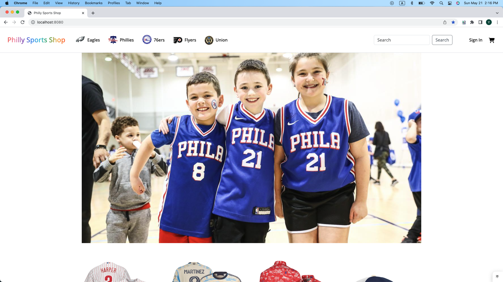

# Philly Sports Shop

## Overview
The objective of this project is to design and develop an online shopping website that sells sports gear for major sports teams in Philadelphia. Sports fans are usually fans of several local sports teams, so this website will allow customers to purchase sports gear products for different sports teams at one website. The website will have a user-friendly interface that will enable users to browse products based on teams, search for products, view product descriptions, add products to their cart, and complete the checkout process.

## Features
1. Product Catalog: The home page shows a carousel of fans wearing sports gear from differet teams, and then list some popular products. In the navbar, customers can select which sports team they would like to browse products. 

the website has Customers browse through different categories of sports gear products. Users will be able to filter products by sport, price, brand, and other relevant criteria.

User Registration: Customers will be able to register and create their accounts on the website. They will be required to provide basic information such as name, email address, and contact details.
Product Catalog: The website will feature a comprehensive product catalog that will allow users to browse through different categories of sports gear products. Users will be able to filter products by sport, price, brand, and other relevant criteria.
Product Detail Page: Each product will have a dedicated page that will display detailed information about the product, including product images, description, specifications, and customer reviews.
Shopping Cart: Users will be able to add products to their shopping cart and continue browsing the website. They will also be able to view the contents of their cart and remove products if necessary.
Checkout: The checkout process will be simple and straightforward, allowing users to complete their purchases quickly and easily. Users will be able to choose their preferred payment method and provide their shipping address.
Order Tracking: Customers will be able to track their orders on the website and receive notifications when their orders are shipped and delivered.
Customer Support: The website will have a dedicated customer support team that will be available to assist users with any queries or issues they may have.
